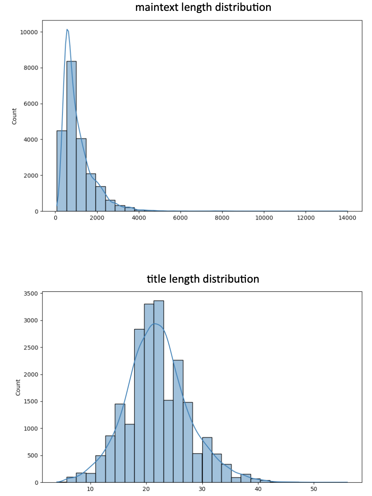

# Chinese-news-summarization
### Task Description - Chinese News Title Generation
Given a full news article as input, the model generates a concise headline as the output.  
The model is fine-tuned based on **T5-small** and utilizes both greedy decoding and beam search for summarization generation.

## Performance
Evaluation metrics: **ROUGE score**
|               | rouge-1    | rouge-2    | rouge-L    |
|---------------|------------|------------|------------|
| Baseline      | 0.225      | 0.085      | 0.205      |
| Result        | **0.261**  | **0.103**  | **0.234**  |

The ROUGE evaluation was performed using the method provided in [this repository](https://github.com/deankuo/ADL24-HW2).
## Data
Source: news articles scraped from udn.com  
* Train: 21710 articles from 2015-03-02 to 2021-01-13
* Public testing: 5494 articles from 2021-01-14 to 2021-04-10  

Data can be downloaded on [Google Drive](https://drive.google.com/drive/folders1PMa25MwIVWTRhUtkWTfBFgqbqmGAxG2-).  
In `train.jsonl`, the token length distributions of **maintext** and **title** are shown in the figure below.

## Model Weights
This project uses pre-trained [google/mt5-small](https://huggingface.co/google/mt5-small) from Hugging Face as the backbone for fine-tuning.  
The fine-tuned model weights are available via [Google Drive](https://drive.google.com/file/d/1oH4KqUhyHJ9pUPiiF1CIDOz7awi5sb7O/view?usp=share_link).
## Training
```
# Run training
python train.py \
--train_file '/path/to/train.jsonl' \
--source_prefix 'summarize: ' \
--model_name_or_path '/path/to/google--mt5-small' \
--output_dir '/path/to/save/checkpoint' \
```
## Testing
```
# Run testing
python test.py \
--test_file '/path/to/public.jsonl' \
--model_name_or_path '/path/to/fine-tuned/t5-small/weights' \
--output_file '/path/to/submission.jsonl' \
```